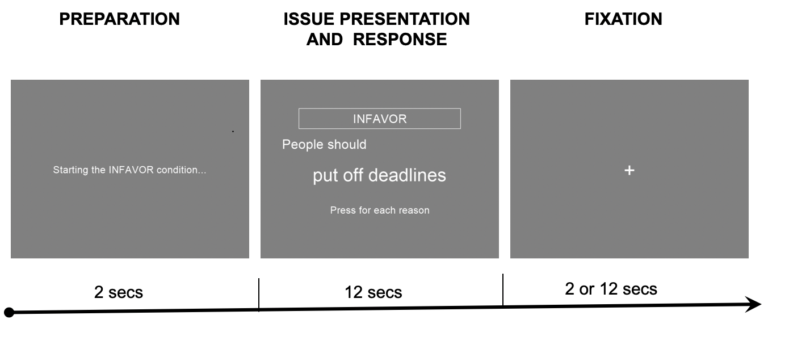
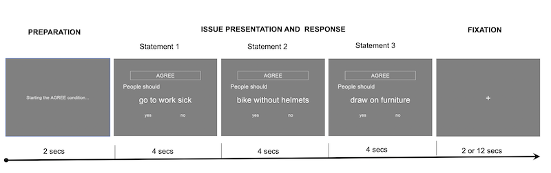
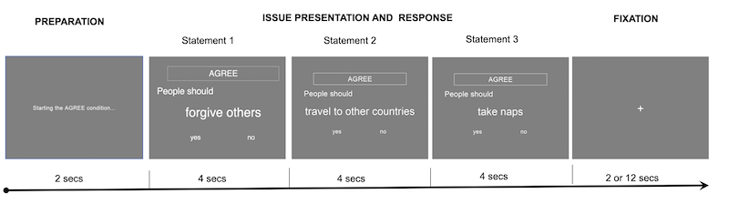

# An fMRI Localizer Task for Deliberative Counterarguing

## Stimuli

### Generic task

The stimuli consist of 70 non-threatening normative statements that all begin with 'People should' (e.g. People should do the crossword) (see Table 1 for the full list of statements). 

Stimuli were pre-testing using Amazon MTurk to determine the extent to which participants agreed or disagreed 
with the statement and the ease or difficulty to which participants could actively generate reasons in favor or reasons against these statements. For example, given the statement _People should vote in local elections_, a reason such as voting is a civic duty would be counted as a reason in favor of the statement whereas only national elections matter would be an example of a reason against the statement. For each statement, we calculated a difference score, in which we subtracted the number of against reasons from the number of in favor reasons. Thus, a positive score indicates that participants had an easier time generating in favor over against reasons, a negative score suggests that participants had an easier time generating against reasons over in favor, and a 0 score indicates that participants generated an equal number of in favor and against reasons.

Table 1. Sentence completions for generic CA task normalized using MTurk

| Easy to generate reasons in favor (easy in favor)	| Easy to generate reasons against (easy against) | 	            Middle                |
| ------------------------- | ----------------------- | ------------------------ |
| adopt animals in need	| act without thinking | get to bed early |
| always try to do better	| arrive late	| sleep in |
| continue to learn	| be late to appointments	| squash bugs and spiders |
| do the crossword | bike on the sidewalk | stay up late |
| follow the news	|  bike without helmets	|  talk to strangers  |
| forgive others |	block an empty seat  |	use weed killer  |
| help those in need |	boast about money	|  vote in local elections |
| keep a journal |	carve initials in trees	|  wake up earlier  |
| keep in touch with friends  |	cheat on a test  |   |
| learn another language  |	draw on furniture	 |   |
| listen to others |	drive through red lights  |   |
| listen to the radio |	drive too close together	|   |
| make new friends |	get tatoos	|   |
| make time for hobbies |	go to work sick	 |   |
| reach goals |	hit other people	|   |
| read more books	|  ignore current events	|   |
| remember the past |	judge others	|   |
| respect elders |	leave dishes in the sink	|   |
| share with one another |	lie to friends	|  |
| sing in the shower |	play loud music	|  |
| speak up |	put off deadlines	|   |
| spend time with friends	| run with scissors	|  |
| take naps	| speed while driving	|  |
| take risks |	talk during movies |  |
| take short showers |	talk loudly on the phone	|  |
| travel to other countries	| talk over another person	|  |
| use public transportation	| tell lies | |
| volunteer	| text in meetings	| |
| watch world news	| text while driving |  |
| work hard	| use plastic forks	|  |
| work together	| write in library books |  |

## Generic counter arguing task

The task consists if 3 within-subject conditions (see Figures 1 & 2). 

* In condition 1 (IN FAVOR), participants are presented with the normative statements and asked to generate reasons in favor of the statement and press a button as they thought of each reason (Figure 1a). 

* In condition 2 (AGAINST), participants are asked to generate reasons against the statements, with an accompanying button press (Figure 1b). 

* Finally, in condition 3 (AGREE), participants are asked to indicate whether they agree or disagree with the statement (Figure 2).

<figure>
  
  <figcaption>Fig. 1a. Deliberative IN FAVOR condition with an easy against issue</figcaption>
</figure>

Each trial started with a prompt indicating which task participants had to perform (e.g., condition 1: _Starting the IN FAVOR condition_; condition 3: _Starting the AGREE condition_) for 3 seconds. In the two deliberative conditions, participants were then shown one statement for 12 seconds,  Participants either indicated, via a button press, the number of in favor/against reasons for each statement (in conditions 1 and 2) or the extent to which they agreed/disagreed with each statement (condition 3). This was then followed by a fixation cross for either 2 seconds or 12 seconds every fourth trial.

<figure>
  
  <figcaption>Fig. 2a. Quick judgement condition (AGREE) with easy against issues</figcaption>
</figure>

<figure>
  
  <figcaption>Fig. 2b. Quick judgement (AGREE) condition with easy in favor issues</figcaption>
</figure>

Conditions 1 and 2 each had 10 trials whereas condition 3 had 30 trials. Each condition had an equal number of easy in favor and easy against statements (i.e., conditions 1 and 2 each had 5 easy in favor and 5 easy against, condition 3 had 15 easy in favor and 15 easy against statements). The order of the three conditions were randomly presented to each participant.

## Data modeling and analysis

Data were modeled using fixed-effects general linear models for each participant as implemented in SPM8, using SPM’s canonical difference of gamma hemodynamic response function (HRF). The six rigid-body translation and rotation parameters derived from spatial realignment were also included as nuisance regressors in all first-level models. Data were high-pass filtered with a cutoff of 128. In study 1, three trial types were modeled: 1. quick judgement (referred to as the AGREE condition), 2. deliberative pro-argumentation (IN FAVOR condition) and 3. deliberative counter-arguing (AGAINST condition). For conditions 2 and 3 two additional regressors where added using the number of button presses (i.e. arguments generated) as what SPM terms _parametric modulators_.  In study 2, the two deliberative conditions (IN FAVOR and AGAINST) were modeled, along with two further regressors incorporating the number of arguments generated, as in study 1 models. Fixation trials were not modeled and constituted an implicit baseline. The six rigid-body translation and rotation parameters derived from spatial realignment were also included as nuisance regressors. Data were high-pass filtered with a cutoff of 128s.

## Regions of interest
